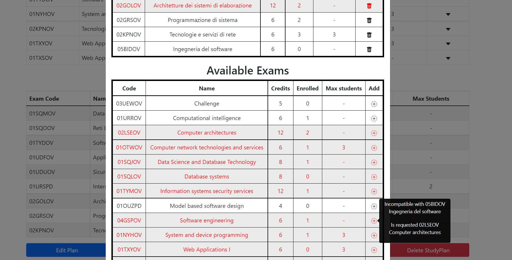

# Exam #1: "StudyPlan"
## Student: s305951 COLELLA EDOARDO 

## React Client Application Routes

- Route `/`: if not logged it shows exam table. 
  
  If logged it shows exam table and, if already created, the study plan

  If not created a button to create a study plan
- Route `/login`: it shows a form to login

## API Server

- GET `/api/exams`
  - request parameters and request body content: ```none```
  - response body content:
  ``` 
  Exam {
    code: '01NYHOV',
    name: 'System and device programming',
    credits: 6,
    maxStudents: 3,
    preparatoryCourse: null,
    incompatible: [ '02GRSOV' ],
    enrolled: 1
  },
  Exam {
    code: '01OTWOV',
    name: 'Computer network technologies and services',
    credits: 6,
    maxStudents: 3,
    preparatoryCourse: null,
    incompatible: [ '02KPNOV' ],
    enrolled: 1
  }, ... 
  ```
- GET `/api/exams/user` 
  - user code is provided by passport session
  - request parameters: ```none```
  - response body content
  ```
  Exam {
    code: '01SQMOV',
    name: 'Data Science e Tecnologie per le Basi di Dati',
    credits: 8,
    maxStudents: null,
    preparatoryCourse: null,
    incompatible: [],
    enrolled: 2
  },
  Exam {
    code: '01SQOOV',
    name: 'Reti Locali e Data Center',
    credits: 6,
    maxStudents: null,
    preparatoryCourse: null,
    incompatible: [],
    enrolled: 2
  },...
  ```
- POST `/api/plan/:typeOfPlan`
  - user code is provided by passport session
  - request parameters and request body content:
  ```
  body: [ '01UDFOV', '02GOLOV', '03UEWOV' ] 
  typeOfPlan: "PartTime"
  ```
  - response body content
  ```
  [
  Exam {
    code: '01UDFOV',
    name: 'Applicazioni Web I',
    credits: 6,
    maxStudents: null,
    preparatoryCourse: null,
    incompatible: [],
    enrolled: 1
  },
  Exam {
    code: '02GOLOV',
    name: 'Architetture dei sistemi di elaborazione',
    credits: 12,
    maxStudents: null,
    preparatoryCourse: null,
    incompatible: [],
    enrolled: 2
  },
  Exam {
    code: '03UEWOV',
    name: 'Challenge',
    credits: 5,
    maxStudents: null,
    preparatoryCourse: null,
    incompatible: [],
    enrolled: 1
  }
  ]
  ```
- DELETE `/api/plan`
  - user code is provided by passport session
  - request parameters and request body content: ```none```
  - response body content: ```none```
- POST `/api/sessions`
  - request parameters
  ```
    {
      username: "s000001@student.com"
      password: "testpassword1"
    }
  ```
  - response body content:
  ```
  Student {
  code: 's000001',
  email: 's000001@student.com',
  name: 'Andrea',
  surname: 'Bianchi',
  typeOfPlan: null
  }
  ```
- GET `/api/session/current`
  - user code is provided by passport session
  - request parameters and request body content: ```none```
  - response body content:
  ```
  Student {
  code: 's000001',
  email: 's000001@student.com',
  name: 'Andrea',
  surname: 'Bianchi',
  typeOfPlan: null
  }
  ```
- DELETE `/api/session/current`
  - user code is provided by passport session
  - request parameters and request body content: ```none```
  - response body content: ```none```


## Database Tables

- Table `Exams` - contains (code, name, credits, maxStudents, preparatoryCourse)
- Table `IncompatibleExams` - contains (Code1, Code2)
- Table `Students` - contains (studentCode, email, name, surname, partTme, password, salt)
- Table `StudentHasExam` - contains (studentCode, examCode)

## Main React Components

- `MyModal` (in `myModal.js`): A modal where is possible to create or edit the study plan of the user
- `ActualRow` (in `myModal.js`): A component with all the info about exams already present in the plan
- `AvailableRow` (in `myModal.js`): A component with all the info about available exams
- `LoginForm` (in `authComponents.js`): A form where is possible to insert email and password to login
- `ExamTable` (in `examTable.js`): A table that shows all the exams. Every row, if possible, can be expanded
- `MyNavbar` (in `myNavbar.js`): The navbar of the web app with a button to login/logout
- `StudyPlan` (in `studyPlan.js`): A page that shows the ExamTable and the StudyPlan, if existant, or buttons to create it

## Screenshot
<p></p>


## Users Credentials

  I assumed that passwords must have a minimum length of 6 characters

|      username       |   password    |
| :-----------------: | :-----------: |
| s000001@student.com | testpassword1 |
| s000002@student.com | testpassword2 |
| s000003@student.com | testpassword3 |
| s000004@student.com | testpassword4 |
| s000005@student.com | testpassword5 |

## Additional notes

-   ```02KPNOBV-Tecnologie e servizi di rete``` and ```01OUZPD-Internet Video Streaming``` have reached the maximum number of enrolled students
- s000001@student.com and s000002@student.com have a FullTime Study Plan
- s000003@student.com and s000005@student.com have a PartTime Study Plan
- s000004@student.com has not a StudyPlan
- in the folder /server/database a file named ```dbSketch.sql``` is provided. It contains the sql query to reset the db, if needed